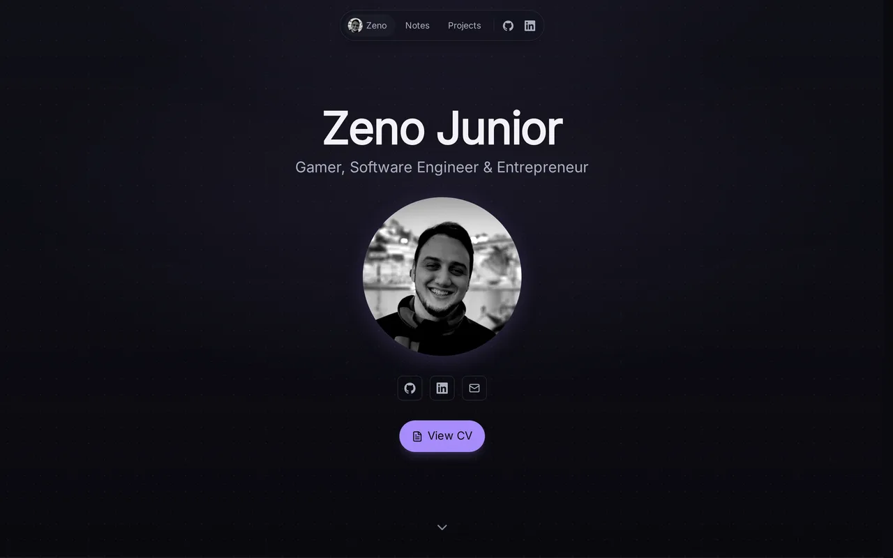

# zenojunior.com

My personal site: portfolio, project case studies, and notes. Live at **[zenojunior.com](https://zenojunior.com)**.



## Tech stack

- [Astro](https://astro.build) with content collections and MDX
- [Tailwind CSS v4](https://tailwindcss.com)
- [Mermaid](https://mermaid.js.org) for interactive project flowcharts
- [Satori](https://github.com/vercel/satori) + [resvg](https://github.com/yisibl/resvg-js) for dynamic Open Graph images
- [Motion](https://motion.dev) and [Floating UI](https://floating-ui.com) for animations and tooltips
- pnpm + [Turborepo](https://turbo.build) monorepo

## Structure

```
apps/
  site/        Astro site (pages, content, components)
packages/
  cv/          Shared CV/resume data consumed by the site
```

- Project case studies live in `apps/site/src/content/projects/*.{md,mdx}`.
- Notes live in `apps/site/src/content/notes/*.{md,mdx}`.

## Getting started

Requires Node `>=22.12` and pnpm.

```bash
pnpm install
pnpm dev      # start the dev server
pnpm build    # build all packages
pnpm preview  # preview the production build
```

### Working on the site only

```bash
pnpm --filter @repo/site dev
pnpm --filter @repo/site build
pnpm --filter @repo/site lint
```

## License

Source is public for reference. Content, images, and branding are © Zeno Junior, all rights reserved.
